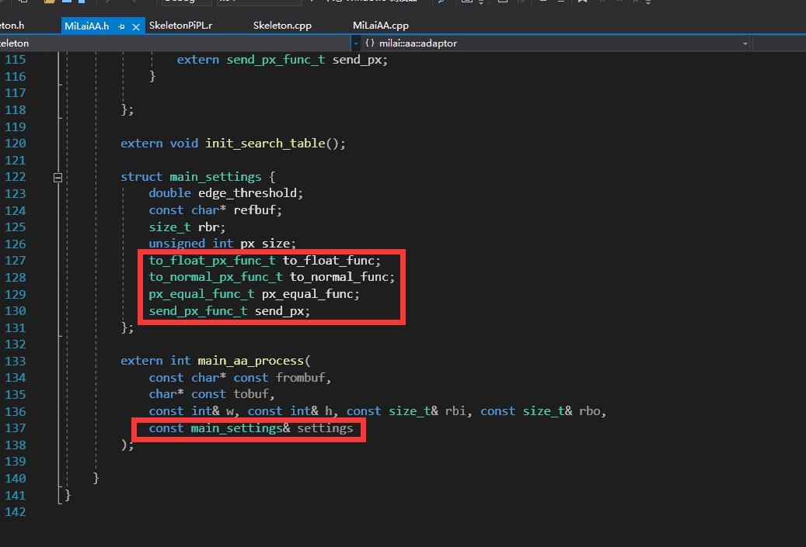

# A good workflow of Ae plugin development

by ZzStarSound(中梓星音)
> 20 March 2021


## Abstract 

One of the toughest and boring tasks, when developing an Ae plugin, is the pixel format conversion algorithm. 

Since yet a standard way has not appeared, we would like to provide a good way to separate the pixel format converting off the main process algorithm. 

In the main process algorithm, the pixels will be converted from `ARGB 8,16,32bpc` to `RGBA 0~1 doubles`. Things will be easier with uniform-pixel-format handling. 

The algorithm coded in the way we provide can also be seamlessly transferred to any host(PhotoShop, OBS, etc.). The extra work of this transfer is only to add a new adaptor in step 3 & 4. 

## 1. State 4 major function types doing the pixel converting jobs


- **to_float_px_func_t:** 
A parser function that converts colors from Ae pixels to doubles in range 0~1
- **to_normal_px_func_t:**
A parser function that converts colors from doubles in 0~1 back to Ae pixels. 
- **px_equal_func_t:** (Optional)
Comparing if two Ae pixels are equivalent. 
- **send_px_func_t:** (Optional)
Copying a pixel from input Ae pixel to output Ae pixel


## 2. Write templates of them in the same header file


Here are the full implementations of these templates. 

```cpp
template <
    typename chT,
    size_t max_valuei,
    unsigned char chR = 0,
    unsigned char chG = 1,
    unsigned char chB = 2,
    unsigned char chA = 3>
static void to_float(double* to, const void* from)
{

    const double maxvf = (double)max_valuei;

    to[0] = ((const chT*)from)[chR] / maxvf;
    to[1] = ((const chT*)from)[chG] / maxvf;
    to[2] = ((const chT*)from)[chB] / maxvf;
    to[3] = ((const chT*)from)[chA] / maxvf;
}

template <
    typename chT,
    size_t max_valuei,
    bool normalize = true,
    unsigned char chR = 0,
    unsigned char chG = 1,
    unsigned char chB = 2,
    unsigned char chA = 3>
static void to_normal(void* to, const double* from)
{
    const chT maxv = (chT)max_valuei;
    const double maxvf = (double)max_valuei;
    if (normalize) {

        if (from[0] > 1.)
            ((chT*)to)[chR] = maxv;
        else if (from[0] < 0.)
            ((chT*)to)[chR] = (chT)0;
        else
            ((chT*)to)[chR] = (chT)(from[0] * max_valuei + .5);

        if (from[1] > 1.)
            ((chT*)to)[chG] = maxv;
        else if (from[1] < 0.)
            ((chT*)to)[chG] = (chT)0;
        else
            ((chT*)to)[chG] = (chT)(from[1] * max_valuei + .5);

        if (from[2] > 1.)
            ((chT*)to)[chB] = maxv;
        else if (from[2] < 0.)
            ((chT*)to)[chB] = (chT)0;
        else
            ((chT*)to)[chB] = (chT)(from[2] * max_valuei + .5);

        if (from[3] > 1.)
            ((chT*)to)[chA] = maxv;
        else if (from[3] < 0.)
            ((chT*)to)[chA] = (chT)0;
        else
            ((chT*)to)[chA] = (chT)(from[3] * max_valuei + .5);
    }
    else {
        ((chT*)to)[chR] = (chT)(from[0] * max_valuei);
        ((chT*)to)[chG] = (chT)(from[1] * max_valuei);
        ((chT*)to)[chB] = (chT)(from[2] * max_valuei);
        ((chT*)to)[chA] = (chT)(from[3] * max_valuei);
    }
}

template <typename chT, unsigned char chA = 3>
static bool px_equal(const void* px1, const void* px2)
{
    if (((chT*)px1)[chA] == (chT)0 && ((chT*)px2)[chA] == (chT)0)
        return true;
    return memcmp(px1, px2, sizeof(chT) * 4) == 0;
}

template <typename chT>
static void send_px(void* to, const void* from)
{
    memcpy(to, from, sizeof(chT) * 4);
}

```

## 3. State all required pixel format functions in the same header file


## 4. Write the implementations of all required pixel format functions in the corresponding cpp file


## 5. Give a structure to hold all the current pixel format settings and set it as an argument of your main process algorithm

Work in step 5 should be done in the header file. 




## 6. Write your process algorithm 

Here is an example to invert the color of the input image. 

**Note that you don't have to consider the pixel format inside this function.**

```cpp
int main_aa_process(
    const char* const frombuf,
    char* const tobuf,
    const int& w, const int& h, const size_t& rbi, const size_t& rbo,
    const main_settings& settings)
{

    double buffer[4];
    for (int y = 0; y < h; ++y)
        for (int x = 0; x < w; ++x) {
            // Fetch color from the current Ae layer to the buffer
            settings.to_float_func(buffer, frombuf + x * settings.px_size + y * rbi);

            // Invert RGB colors
            for (int i = 0; i < 3; i++) {
                buffer[i] = 1. - buffer[i];
            }

            // Send the pixel back to the Ae layer.
            settings.to_normal_func(tobuf + x * settings.px_size + y * rbo, buffer);
        }
}
```

## 7. Send settings and call your algorithm while SmartRender() has been triggered


